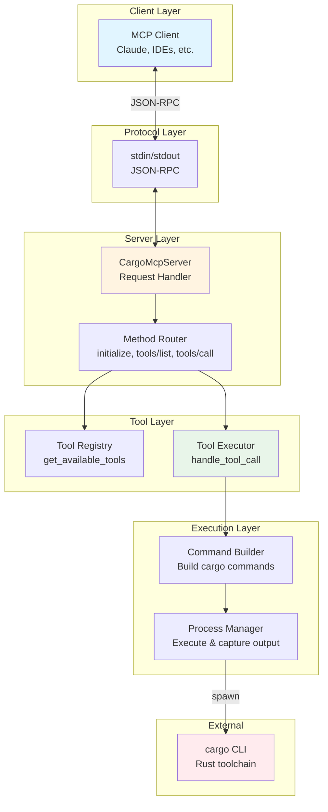
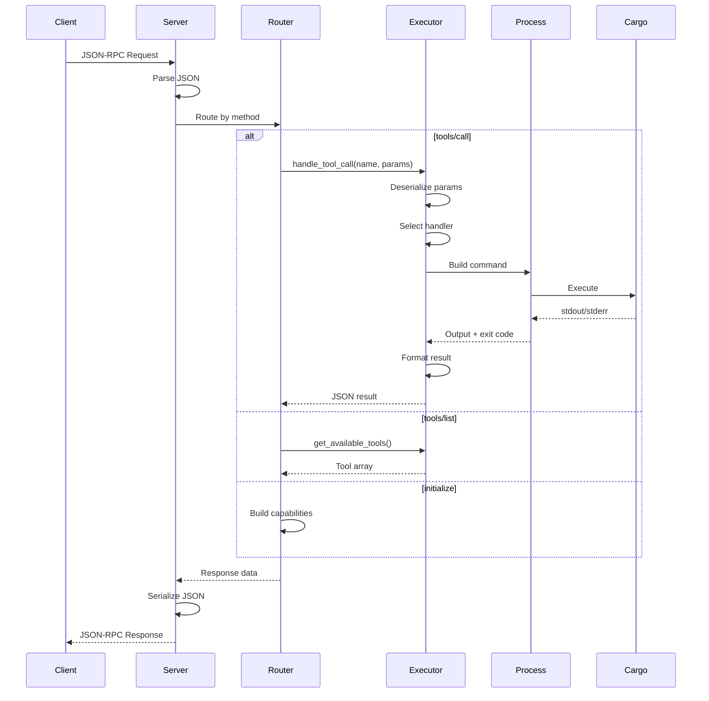
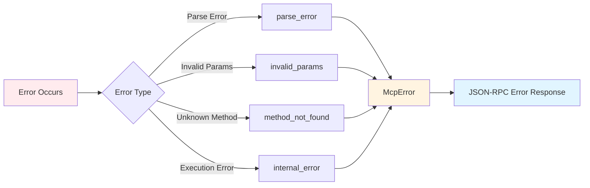

# Architecture Documentation

## System Architecture

cargo-mcp is a Model Context Protocol (MCP) server that acts as a bridge between MCP clients and the Rust cargo toolchain. It follows a layered architecture with clear separation of concerns.



## Architectural Layers

### 1. Protocol Layer
**Responsibility**: JSON-RPC communication over stdin/stdout

- Implements MCP protocol version 2024-11-05
- Async I/O using tokio
- Bidirectional message passing
- Protocol-compliant error handling

### 2. Server Layer (`server.rs`)
**Responsibility**: Request routing and response formatting

**Key Components**:
- `CargoMcpServer`: Main server struct
- `run()`: Async server loop
- `handle_request()`: Request dispatcher

**Supported Methods**:
- `initialize`: Server capability negotiation
- `notifications/initialized`: Initialization acknowledgment
- `tools/list`: Return available tools
- `tools/call`: Execute a specific tool

### 3. Tool Layer (`tools/`)
**Responsibility**: Tool definition and execution orchestration

**Components**:
- `definitions.rs`: Tool registry
- `workflow_tools.rs`: Tool schema definitions (200 LOC)
- `executor.rs`: Execution logic (920 LOC)

### 4. Execution Layer (`executor.rs`)
**Responsibility**: Cargo command construction and execution

**Specialized Handlers**:
- `handle_pre_build()`: check, build operations
- `handle_build()`: Compilation tasks
- `handle_lint()`: clippy, fmt operations
- `handle_test()`: test, bench execution
- `handle_add_crate()`: Dependency addition
- `handle_remove_crate()`: Dependency removal
- `handle_crate_info()`: Registry queries
- `handle_search_crates()`: Package search
- `handle_clean()`: Artifact cleanup

## Design Patterns

### 1. Command Pattern
Each cargo operation is encapsulated as a tool with:
- Name and description
- JSON schema for parameters
- Execution handler

### 2. Builder Pattern
Cargo commands are constructed incrementally:
```rust
let mut cmd = Command::new("cargo");
cmd.arg("build");
if release { cmd.arg("--release"); }
if let Some(pkg) = package { cmd.arg("--package").arg(pkg); }
```

### 3. Error Handling Strategy
- `anyhow::Result` for internal error propagation
- `McpError` for protocol-level errors
- Structured error responses with codes and messages

### 4. Async I/O
- Tokio runtime for non-blocking operations
- Async stdin/stdout handling
- Synchronous cargo execution (subprocess)

## Data Flow

### Request Processing Flow


### Error Flow


## Concurrency Model

- **Single-threaded async**: One tokio runtime
- **Sequential request processing**: Requests handled one at a time
- **Blocking subprocess calls**: Cargo execution blocks until completion
- **No shared state**: Stateless server design

## Extension Points

### Adding New Tools
1. Define tool schema in `workflow_tools.rs`
2. Add handler function in `executor.rs`
3. Register in `handle_tool_call()` match statement

### Custom Parameters
Extend `CargoToolParams` struct in `types.rs` with new fields

### Error Types
Add new error constructors in `error.rs` for specific error cases

## Performance Considerations

- **Startup time**: Minimal (no heavy initialization)
- **Memory footprint**: Low (stateless, no caching)
- **Execution time**: Dominated by cargo subprocess
- **Scalability**: Limited by sequential processing

## Security Considerations

- **Command injection**: Parameters are passed as separate args (not shell interpolation)
- **Working directory**: Validated and set per-command
- **No privilege escalation**: Runs with user permissions
- **Input validation**: JSON schema validation via serde
