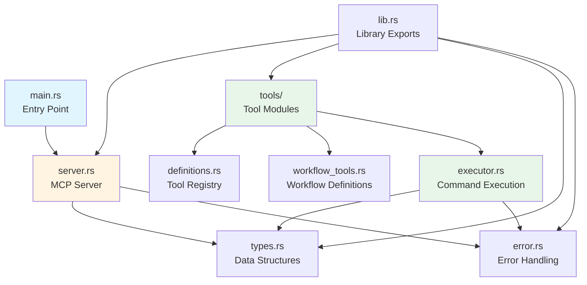
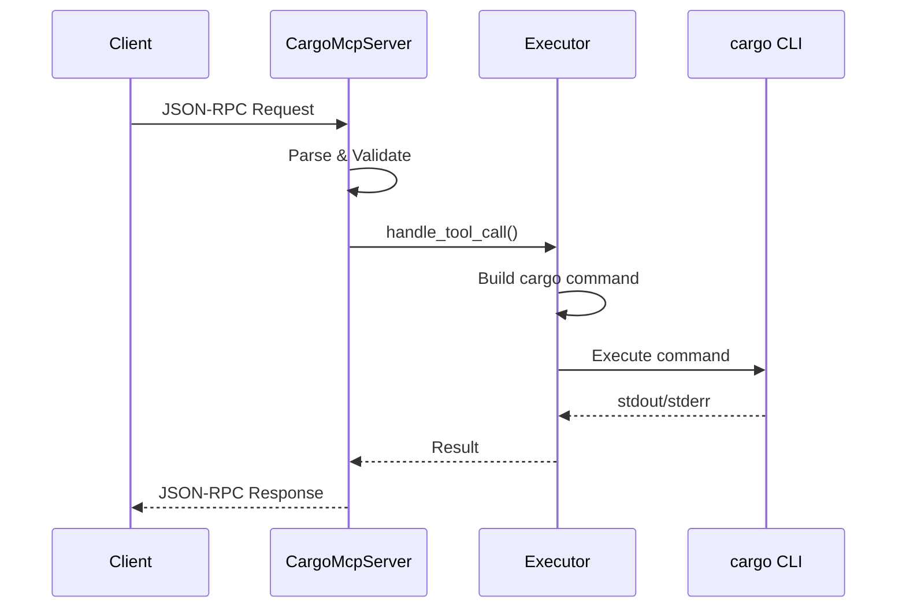

# Codebase Information

## Project Overview

**Name**: cargo-mcp  
**Version**: 0.1.0  
**Language**: Rust (Edition 2024)  
**Type**: Model Context Protocol (MCP) Server  
**Purpose**: Provides tools for managing Rust projects using the `cargo` command-line tool

## Technology Stack

### Core Dependencies
- **tokio** (1.0) - Async runtime with full features
- **serde** (1.0) - Serialization framework with derive macros
- **serde_json** (1.0) - JSON serialization/deserialization
- **anyhow** (1.0) - Error handling
- **clap** (4.0) - Command-line argument parsing with derive macros

### Language Support
- **Rust**: Full support (primary language)

## Codebase Structure



## Directory Hierarchy

```
cargo-mcp/
├── src/
│   ├── main.rs              # Application entry point
│   ├── lib.rs               # Library module exports
│   ├── server.rs            # MCP server implementation (CargoMcpServer)
│   ├── types.rs             # Core data structures (Tool, CargoToolParams, McpRequest/Response)
│   ├── error.rs             # Error types and handling (McpError)
│   └── tools/
│       ├── mod.rs           # Tool module exports
│       ├── definitions.rs   # Tool registry (get_available_tools)
│       ├── workflow_tools.rs # Workflow tool definitions (get_workflow_tools)
│       └── executor.rs      # Command execution logic (handle_tool_call, execute_cargo_command)
├── Cargo.toml               # Project manifest
├── Cargo.lock               # Dependency lock file
├── README.md                # User documentation
└── mcp-config-example.json  # Example MCP client configuration
```

## Key Components

### 1. Server Layer (`server.rs`)
- **CargoMcpServer**: Main server struct implementing MCP protocol
- Handles initialization, tool listing, and tool execution requests
- Manages JSON-RPC communication over stdin/stdout

### 2. Tool System (`tools/`)
- **definitions.rs**: Central registry of available cargo tools
- **workflow_tools.rs**: Defines comprehensive cargo workflow tools (200 LOC)
- **executor.rs**: Core execution engine (920 LOC)
  - Command execution with proper error handling
  - Specialized handlers for different cargo operations
  - Pre-build checks, dependency management, registry operations

### 3. Type System (`types.rs`)
- **Tool**: Tool definition structure
- **CargoToolParams**: Comprehensive parameter structure for cargo commands
- **McpRequest/McpResponse**: Protocol message types

### 4. Error Handling (`error.rs`)
- **McpError**: Custom error type for MCP operations
- Helper functions: `internal_error`, `invalid_params`, `method_not_found`, `parse_error`

## Architecture Patterns

### Design Principles
1. **Modular Organization**: Clear separation between server, tools, types, and errors
2. **Protocol Compliance**: Implements MCP protocol version 2024-11-05
3. **Async-First**: Built on tokio for async I/O operations
4. **Type Safety**: Strong typing with serde for serialization
5. **Error Propagation**: Consistent error handling with anyhow and custom McpError

### Communication Flow


## Code Statistics

- **Total Files**: 115 (including dependencies)
- **Prioritized Source Files**: 9
- **Total Lines of Code**: 1,553
- **Functions**: 20
- **Structs/Enums**: 6

### File Complexity Scores
1. **executor.rs**: 220.0 (highest complexity - core execution logic)
2. **server.rs**: 37.3 (server implementation)
3. **types.rs**: 12.9 (data structures)
4. **error.rs**: 9.1 (error handling)

## Integration Points

### Input/Output
- **stdin/stdout**: JSON-RPC communication channel
- **Process execution**: Spawns cargo subprocess for command execution

### External Dependencies
- **cargo**: Required system dependency for all operations
- **rustfmt**: Required for `fmt` tool
- **clippy**: Required for `clippy` tool

## Tool Categories

The server provides 20+ cargo tools organized into:
1. **Build Tools**: check, build, clippy, fmt
2. **Execution Tools**: run, test, bench
3. **Dependency Management**: add, remove, update, tree
4. **Project Management**: new, init, clean, doc
5. **Registry Operations**: search, info, install, uninstall
6. **Utility Tools**: metadata, version

## Development Workflow

### Build Process
```bash
cargo build --release
```

### Testing
No test files currently present in the codebase.

### Code Quality
- Format: `cargo fmt`
- Lint: `cargo clippy`
- Check: `cargo check`
