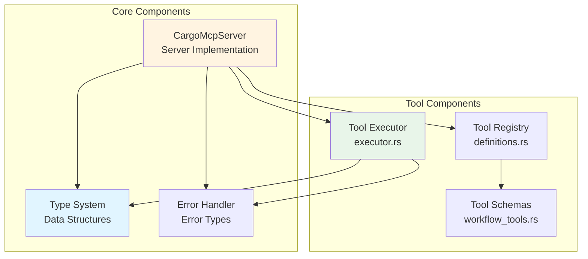
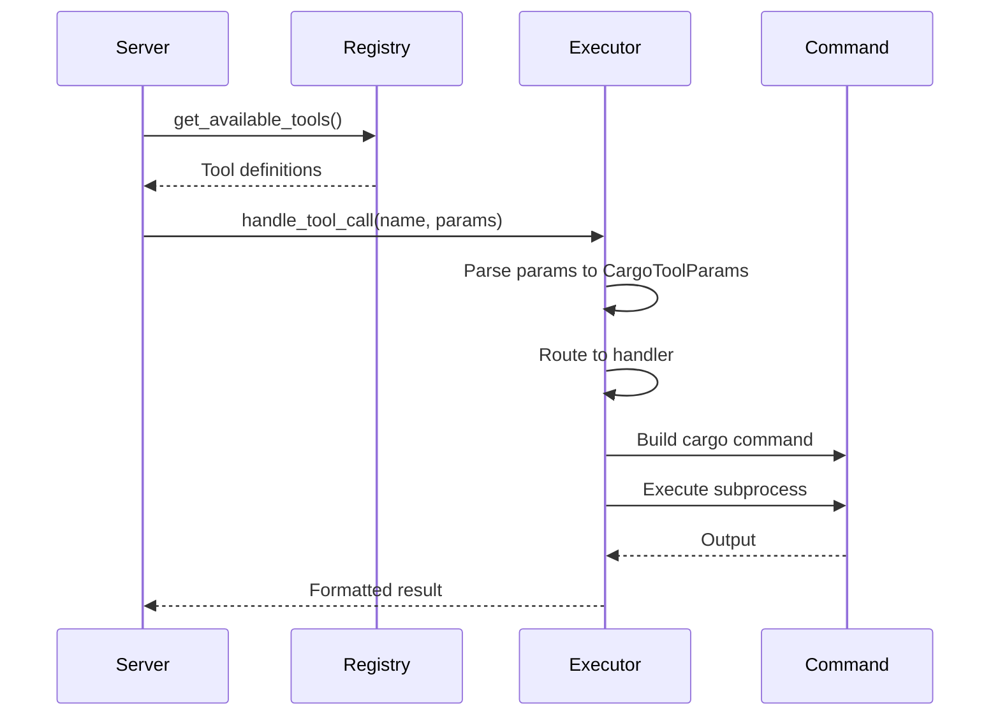
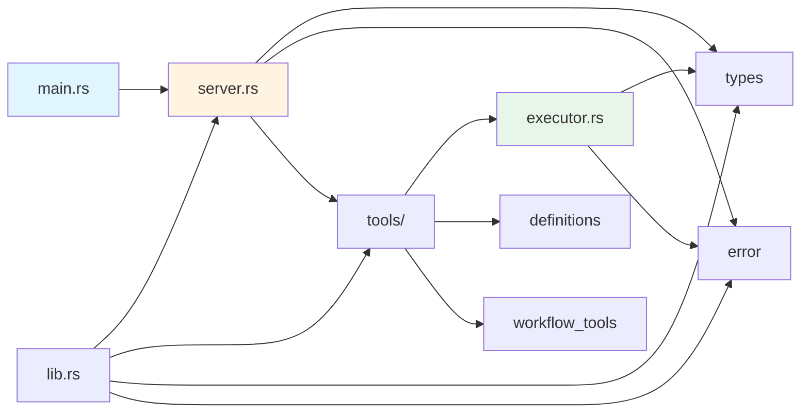

# Components Documentation

## Component Overview



## 1. CargoMcpServer (server.rs)

**Purpose**: Main MCP server implementation handling protocol communication

**Responsibilities**:
- Accept and parse JSON-RPC requests from stdin
- Route requests to appropriate handlers
- Format and send JSON-RPC responses to stdout
- Manage server lifecycle

**Key Methods**:
- `run()`: Main async loop reading from stdin and writing to stdout
- `handle_request(request: McpRequest) -> McpResponse`: Request dispatcher

**Supported Operations**:
- `initialize`: Returns server capabilities and version info
- `notifications/initialized`: Acknowledges initialization
- `tools/list`: Returns array of available cargo tools
- `tools/call`: Executes a specific cargo tool

**Dependencies**:
- tokio for async I/O
- serde_json for JSON handling
- Tool registry and executor

**Lines of Code**: 150

---

## 2. Tool Executor (tools/executor.rs)

**Purpose**: Core execution engine for cargo commands

**Responsibilities**:
- Parse tool parameters
- Build cargo command with appropriate flags
- Execute cargo subprocess
- Capture and format output
- Handle execution errors

**Key Functions**:

### `handle_tool_call(tool_name: &str, params: Value) -> Result<Value>`
Main entry point that routes to specialized handlers based on tool name.

### `execute_cargo_command(cmd: &mut Command) -> Result<Value>`
Generic command executor that:
- Spawns cargo subprocess
- Captures stdout and stderr
- Measures execution time
- Formats output as MCP response

### Specialized Handlers:

**`handle_pre_build(params: &CargoToolParams) -> Result<Value>`**
- Handles: `check`, `build`
- Supports all target selection options
- Configures build profiles and features

**`handle_build(params: &CargoToolParams) -> Result<Value>`**
- Extended build operations
- Workspace support
- Message format configuration

**`handle_lint(params: &CargoToolParams) -> Result<Value>`**
- Handles: `clippy`, `fmt`
- Supports auto-fix for clippy
- Handles dirty/staged working directory

**`handle_test(params: &CargoToolParams) -> Result<Value>`**
- Handles: `test`, `bench`
- Test filtering and execution control
- Parallel execution configuration

**`handle_add_crate(params: &CargoToolParams) -> Result<Value>`**
- Add dependencies to Cargo.toml
- Supports dev/build dependencies
- Git and path dependencies
- Feature selection

**`handle_remove_crate(params: &CargoToolParams) -> Result<Value>`**
- Remove dependencies from Cargo.toml
- Handles dev/build dependency removal

**`handle_crate_info(params: &CargoToolParams) -> Result<Value>`**
- Query crate information from registry
- Display package metadata

**`handle_search_crates(params: &CargoToolParams) -> Result<Value>`**
- Search crates.io for packages
- Configurable result limits

**`handle_clean(params: &CargoToolParams) -> Result<Value>`**
- Remove build artifacts
- Clean target directory

**Lines of Code**: 920 (largest component)

---

## 3. Type System (types.rs)

**Purpose**: Define data structures for protocol and tool parameters

**Key Types**:

### `McpRequest`
```rust
pub struct McpRequest {
    pub jsonrpc: String,
    pub id: Option<Value>,
    pub method: String,
    pub params: Option<Value>,
}
```
Represents incoming JSON-RPC requests.

### `McpResponse`
```rust
pub struct McpResponse {
    pub jsonrpc: String,
    pub id: Option<Value>,
    pub result: Option<Value>,
    pub error: Option<McpError>,
}
```
Represents outgoing JSON-RPC responses.

### `Tool`
```rust
pub struct Tool {
    pub name: String,
    pub description: String,
    pub input_schema: Value,
}
```
Tool definition with JSON schema for parameters.

### `CargoToolParams`
Comprehensive parameter structure supporting all cargo command options:
- **Common**: working_directory, package, features, release, target
- **Target Selection**: lib, bin, bins, example, examples, test, tests, bench, benches, all_targets
- **Build Options**: profile, message_format, workspace, exclude
- **Lint Options**: fix, allow_dirty, allow_staged
- **Test Options**: exact, ignored, include_ignored, jobs, nocapture, test_threads
- **Dependency Options**: dependency, dev, build, optional, rename, path, git, branch, tag, rev
- **Registry Options**: query, limit, registry, version
- **Project Options**: name, bin_template, lib_template, edition
- **Doc Options**: open, no_deps, document_private_items
- **Install Options**: Various install-specific parameters

**Lines of Code**: 211

---

## 4. Error Handler (error.rs)

**Purpose**: Centralized error handling for MCP protocol

**Key Type**:

### `McpError`
```rust
pub struct McpError {
    pub code: i32,
    pub message: String,
    pub data: Option<Value>,
}
```

**Error Constructors**:
- `parse_error(message: String) -> McpError`: JSON parsing errors (-32700)
- `invalid_params(message: String) -> McpError`: Invalid method parameters (-32602)
- `method_not_found(method: String) -> McpError`: Unknown method (-32601)
- `internal_error(message: String) -> McpError`: Internal server errors (-32603)

**Lines of Code**: 44

---

## 5. Tool Registry (tools/definitions.rs)

**Purpose**: Central registry of available tools

**Key Function**:
```rust
pub fn get_available_tools() -> Vec<Tool>
```

Delegates to `get_workflow_tools()` for tool definitions.

**Lines of Code**: 6

---

## 6. Tool Schemas (tools/workflow_tools.rs)

**Purpose**: Define JSON schemas for all cargo tools

**Key Function**:
```rust
pub fn get_workflow_tools() -> Vec<Tool>
```

Returns array of 20+ tool definitions organized by category:
- Build tools (check, build, clippy, fmt)
- Execution tools (run, test, bench)
- Dependency management (add, remove, update, tree)
- Project management (new, init, clean, doc)
- Registry operations (search, info, install, uninstall)
- Utility tools (metadata, version)

Each tool includes:
- Name
- Description
- JSON schema with parameter definitions

**Lines of Code**: 200

---

## Component Interactions

### Tool Execution Flow


## Component Dependencies



## Testing Strategy

**Current State**: No test files present in codebase

**Recommended Testing**:
- Unit tests for each executor handler
- Integration tests for full request/response cycle
- Mock cargo commands for deterministic testing
- Error handling test cases
