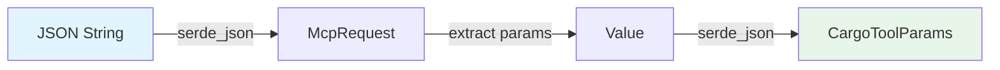
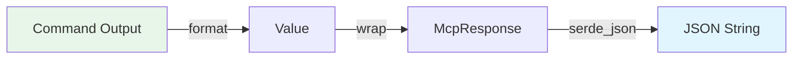
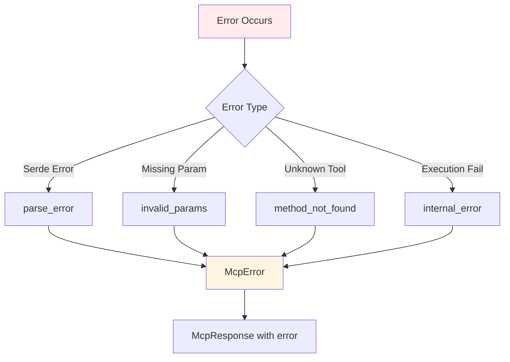

# Data Models Documentation

## Core Data Structures

### Protocol Models

#### McpRequest
Represents an incoming JSON-RPC request from an MCP client.

```rust
pub struct McpRequest {
    pub jsonrpc: String,        // Protocol version ("2.0")
    pub id: Option<Value>,      // Request identifier (can be number or string)
    pub method: String,         // Method name to invoke
    pub params: Option<Value>,  // Method parameters (optional)
}
```

**Usage**: Deserialized from stdin JSON input

**Example**:
```json
{
  "jsonrpc": "2.0",
  "id": 1,
  "method": "tools/call",
  "params": {
    "name": "build",
    "arguments": {"release": true}
  }
}
```

---

#### McpResponse
Represents an outgoing JSON-RPC response to an MCP client.

```rust
pub struct McpResponse {
    pub jsonrpc: String,           // Protocol version ("2.0")
    pub id: Option<Value>,         // Matches request id
    pub result: Option<Value>,     // Success result (mutually exclusive with error)
    pub error: Option<McpError>,   // Error details (mutually exclusive with result)
}
```

**Serialization Rules**:
- `result` is omitted if None
- `error` is omitted if None
- Exactly one of `result` or `error` should be present

**Example** (Success):
```json
{
  "jsonrpc": "2.0",
  "id": 1,
  "result": {
    "content": [{"type": "text", "text": "Build successful"}]
  }
}
```

**Example** (Error):
```json
{
  "jsonrpc": "2.0",
  "id": 1,
  "error": {
    "code": -32603,
    "message": "Build failed"
  }
}
```

---

#### McpError
Represents a protocol-level error.

```rust
pub struct McpError {
    pub code: i32,              // Error code (JSON-RPC standard codes)
    pub message: String,        // Human-readable error message
    pub data: Option<Value>,    // Additional error data (optional)
}
```

**Standard Error Codes**:
- `-32700`: Parse error (invalid JSON)
- `-32600`: Invalid request
- `-32601`: Method not found
- `-32602`: Invalid params
- `-32603`: Internal error

**Constructor Functions**:
```rust
McpError::parse_error(message: String) -> McpError
McpError::invalid_params(message: String) -> McpError
McpError::method_not_found(method: String) -> McpError
McpError::internal_error(message: String) -> McpError
```

---

### Tool Models

#### Tool
Represents a cargo tool definition with its schema.

```rust
pub struct Tool {
    pub name: String,           // Tool identifier (e.g., "build", "test")
    pub description: String,    // Human-readable description
    pub input_schema: Value,    // JSON Schema for parameters
}
```

**Schema Format**: JSON Schema Draft 7

**Example**:
```rust
Tool {
    name: "build".to_string(),
    description: "Compile the current package".to_string(),
    input_schema: json!({
        "type": "object",
        "properties": {
            "release": {"type": "boolean"},
            "package": {"type": "string"}
        }
    })
}
```

---

#### CargoToolParams
Comprehensive parameter structure for all cargo operations.

```rust
pub struct CargoToolParams {
    // Common parameters
    pub working_directory: Option<String>,
    pub package: Option<String>,
    pub features: Option<Vec<String>>,
    pub all_features: Option<bool>,
    pub no_default_features: Option<bool>,
    pub release: Option<bool>,
    pub target: Option<String>,
    
    // Target selection
    pub bin: Option<String>,
    pub example: Option<String>,
    pub test: Option<String>,
    pub bench: Option<String>,
    pub lib: Option<bool>,
    pub bins: Option<bool>,
    pub examples: Option<bool>,
    pub tests: Option<bool>,
    pub benches: Option<bool>,
    pub all_targets: Option<bool>,
    pub no_tests: Option<bool>,
    
    // Build options
    pub warn_only: Option<bool>,
    pub ignore_docs: Option<bool>,
    pub profile: Option<String>,
    pub message_format: Option<String>,
    pub workspace: Option<bool>,
    pub exclude: Option<Vec<String>>,
    
    // Lint options
    pub fix: Option<bool>,
    pub allow_dirty: Option<bool>,
    pub allow_staged: Option<bool>,
    
    // Test options
    pub crate_name: Option<String>,
    pub test_name: Option<String>,
    pub exact: Option<bool>,
    pub ignored: Option<bool>,
    pub include_ignored: Option<bool>,
    pub jobs: Option<u32>,
    pub nocapture: Option<bool>,
    pub test_threads: Option<u32>,
    
    // Dependency management
    pub dependency: Option<String>,
    pub dev: Option<bool>,
    pub build: Option<bool>,
    pub optional: Option<bool>,
    pub rename: Option<String>,
    pub path: Option<String>,
    pub git: Option<String>,
    pub branch: Option<String>,
    pub tag: Option<String>,
    pub rev: Option<String>,
    pub default_features: Option<bool>,
    
    // Registry operations
    pub query: Option<String>,
    pub limit: Option<u32>,
    pub registry: Option<String>,
    pub version: Option<String>,
    
    // Project creation
    pub name: Option<String>,
    pub bin_template: Option<bool>,
    pub lib_template: Option<bool>,
    pub edition: Option<String>,
    
    // Documentation
    pub open: Option<bool>,
    pub no_deps: Option<bool>,
    pub document_private_items: Option<bool>,
    
    // Install options
    pub git_url: Option<String>,
    pub branch_install: Option<String>,
    pub tag_install: Option<String>,
    pub rev_install: Option<String>,
    pub path_install: Option<String>,
    pub bin_install: Option<String>,
    pub bins_install: Option<bool>,
    pub example_install: Option<String>,
    pub examples_install: Option<bool>,
    pub force: Option<bool>,
    pub no_track: Option<bool>,
    pub locked: Option<bool>,
    pub root: Option<String>,
    pub index: Option<String>,
    pub list: Option<bool>,
    
    // Metadata
    pub no_deps_metadata: Option<bool>,
    pub format_version: Option<u32>,
    
    // Tree options
    pub duplicates: Option<bool>,
    pub edges: Option<String>,
    pub format: Option<String>,
    pub invert: Option<Vec<String>>,
    pub no_dedupe: Option<bool>,
    pub prefix: Option<String>,
    pub prune: Option<Vec<String>>,
    pub depth: Option<u32>,
    pub charset: Option<String>,
    
    // Update options
    pub aggressive: Option<bool>,
    pub dry_run: Option<bool>,
    pub precise: Option<String>,
    
    // Run options
    pub args: Option<Vec<String>>,
}
```

**Deserialization**: All fields use `#[serde(default)]` to make them optional

**Usage Pattern**:
```rust
let params: CargoToolParams = serde_json::from_value(arguments)?;
```

---

## Data Flow Diagrams

### Request Deserialization


### Response Serialization


### Error Handling


---

## Parameter Validation

### Schema-based Validation
JSON Schema validation is performed by MCP clients before sending requests. The server relies on serde deserialization for type checking.

### Optional vs Required
- All `CargoToolParams` fields are optional
- Tool-specific required parameters are enforced by cargo itself
- Missing required parameters result in cargo error messages

### Type Coercion
Serde handles type coercion automatically:
- Strings to numbers (where applicable)
- Single values to arrays
- Null to None

---

## Memory Layout

### Stateless Design
- No persistent state between requests
- Each request creates new parameter structures
- Responses are immediately serialized and discarded

### Ownership Model
- `McpRequest`: Owned by request handler
- `CargoToolParams`: Owned by executor function
- `McpResponse`: Owned by server, moved to serializer

---

## Serialization Format

### JSON Conventions
- **Field naming**: snake_case in Rust, camelCase in JSON (via serde rename)
- **Optional fields**: Omitted when None
- **Arrays**: Empty arrays vs null (both supported)
- **Numbers**: i32, u32 for integers, no floating point

### Example Transformation
**Rust**:
```rust
CargoToolParams {
    working_directory: Some("/project".to_string()),
    release: Some(true),
    all_features: Some(true),
    ..Default::default()
}
```

**JSON**:
```json
{
  "working_directory": "/project",
  "release": true,
  "all_features": true
}
```

---

## Extension Guidelines

### Adding New Parameters
1. Add field to `CargoToolParams` with `#[serde(default)]`
2. Update tool schema in `workflow_tools.rs`
3. Handle parameter in executor function

### Adding New Tool Types
1. Define new struct if parameters differ significantly
2. Add to tool registry
3. Implement handler function
4. Update documentation
