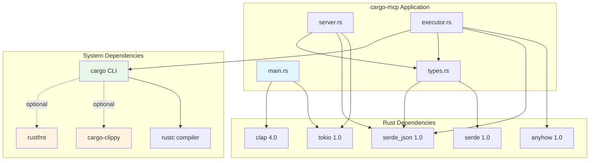

# Dependencies Documentation

## Runtime Dependencies

### Core Dependencies

#### tokio (1.0)
**Purpose**: Async runtime for non-blocking I/O operations

**Features Used**: `full` (all tokio features)

**Usage in Project**:
- Async stdin/stdout handling in server loop
- `AsyncBufReadExt` for line-by-line reading
- `AsyncWriteExt` for response writing
- Main async runtime via `#[tokio::main]`

**Files**: `src/main.rs`, `src/server.rs`

**Why Required**: MCP protocol requires continuous stdin/stdout communication without blocking

---

#### serde (1.0)
**Purpose**: Serialization and deserialization framework

**Features Used**: `derive` (procedural macros for automatic trait derivation)

**Usage in Project**:
- Derive `Serialize` and `Deserialize` for all data structures
- Automatic JSON conversion for protocol messages
- Field renaming (e.g., `inputSchema` vs `input_schema`)
- Optional field handling with `#[serde(default)]`

**Files**: `src/types.rs`, `src/error.rs`

**Why Required**: Protocol communication requires JSON serialization

---

#### serde_json (1.0)
**Purpose**: JSON serialization/deserialization implementation for serde

**Usage in Project**:
- Parse incoming JSON-RPC requests
- Serialize outgoing JSON-RPC responses
- `json!` macro for building JSON values
- `Value` type for dynamic JSON handling

**Files**: All source files

**Why Required**: MCP protocol uses JSON-RPC format

---

#### anyhow (1.0)
**Purpose**: Flexible error handling with context

**Usage in Project**:
- `Result<T>` type alias for functions that can fail
- `.context()` for adding error context
- Error propagation with `?` operator
- Simplified error handling in executor functions

**Files**: `src/tools/executor.rs`

**Why Required**: Simplifies error handling in cargo command execution

---

#### clap (4.0)
**Purpose**: Command-line argument parsing

**Features Used**: `derive` (derive macros for CLI definition)

**Usage in Project**:
- Parse command-line arguments (if any)
- Future extensibility for CLI options

**Files**: `src/main.rs`

**Why Required**: Standard Rust CLI argument handling

---

## External System Dependencies

### Required System Tools

#### cargo
**Purpose**: Rust package manager and build tool

**Version**: Any recent version (typically 1.70+)

**Usage**: All tool operations execute cargo commands

**Installation**: Comes with Rust toolchain via rustup

**Verification**:
```bash
cargo --version
```

---

#### rustc
**Purpose**: Rust compiler

**Version**: Compatible with cargo version

**Usage**: Invoked by cargo for compilation operations

**Installation**: Comes with Rust toolchain via rustup

---

### Optional System Tools

#### cargo-clippy
**Purpose**: Rust linter for catching common mistakes

**Usage**: Required for `clippy` tool

**Installation**:
```bash
rustup component add clippy
```

**Verification**:
```bash
cargo clippy --version
```

---

#### rustfmt
**Purpose**: Rust code formatter

**Usage**: Required for `fmt` tool

**Installation**:
```bash
rustup component add rustfmt
```

**Verification**:
```bash
cargo fmt --version
```

---

## Dependency Graph



---

## Dependency Details

### Version Constraints

**Current Strategy**: Major version pinning with minor/patch flexibility

```toml
tokio = { version = "1.0", features = ["full"] }
serde = { version = "1.0", features = ["derive"] }
serde_json = "1.0"
anyhow = "1.0"
clap = { version = "4.0", features = ["derive"] }
```

**Rationale**:
- Allows patch updates for bug fixes
- Prevents breaking changes from major version bumps
- Standard practice for Rust applications

---

### Feature Flags

#### tokio - "full"
Includes all tokio features:
- Async I/O (fs, io, net)
- Time utilities
- Process spawning
- Synchronization primitives

**Consideration**: Could be reduced to specific features (`io-util`, `rt-multi-thread`) to reduce compile time and binary size

#### serde - "derive"
Enables `#[derive(Serialize, Deserialize)]` macros

**Required**: Yes, used extensively throughout codebase

#### clap - "derive"
Enables `#[derive(Parser)]` macro for CLI definition

**Required**: Yes, for future CLI extensibility

---

## Transitive Dependencies

### Key Transitive Dependencies
(Automatically included by direct dependencies)

- **bytes**: Efficient byte buffer handling (via tokio)
- **syn, quote, proc-macro2**: Procedural macro support (via serde, clap)
- **itoa, ryu**: Fast number formatting (via serde_json)
- **libc**: System call interface (via tokio)

**Total Dependency Count**: ~50-60 crates (including transitive)

---

## Network Dependencies

### crates.io Registry
**Purpose**: Package registry for search, info, install operations

**Usage**: Accessed by cargo commands:
- `cargo search`
- `cargo info`
- `cargo install`
- `cargo add` (fetches package metadata)

**Requirement**: Internet connection for registry operations

**Offline Mode**: Most operations work offline if dependencies are cached

---

### Git Repositories
**Purpose**: Install packages from git sources

**Usage**: `cargo install --git <url>`

**Requirement**: Git must be installed on system

---

## Build Dependencies

### Development Dependencies
**Current**: None

**Recommended for Testing**:
- `assert_cmd`: Test CLI applications
- `predicates`: Assertions for testing
- `tempfile`: Temporary directories for tests

---

## Platform Dependencies

### Operating System Support
- **Linux**: Full support
- **macOS**: Full support
- **Windows**: Full support (with minor path handling differences)

### Architecture Support
- **x86_64**: Primary target
- **aarch64**: Supported (Apple Silicon, ARM servers)
- **Other**: Any architecture supported by Rust toolchain

---

## Dependency Security

### Security Considerations
1. All dependencies are from crates.io (official registry)
2. Major dependencies (tokio, serde) are widely used and audited
3. No known security vulnerabilities in current versions

### Audit Recommendations
```bash
cargo audit
```

### Update Strategy
```bash
cargo update          # Update within version constraints
cargo outdated        # Check for newer versions
```

---

## Dependency Alternatives

### Potential Alternatives

#### Async Runtime
- **Alternative**: `async-std`
- **Reason to keep tokio**: Industry standard, better ecosystem

#### Serialization
- **Alternative**: `bincode`, `postcard`
- **Reason to keep serde_json**: JSON required by MCP protocol

#### Error Handling
- **Alternative**: `thiserror`, `eyre`
- **Reason to keep anyhow**: Simple and sufficient for application errors

#### CLI Parsing
- **Alternative**: `structopt` (deprecated), `argh`
- **Reason to keep clap**: Most feature-rich and maintained

---

## Dependency Impact

### Compile Time
- **tokio**: Significant (large codebase)
- **serde**: Moderate (proc macros)
- **clap**: Moderate (proc macros)
- **Total**: ~30-60 seconds for clean build (varies by system)

### Binary Size
- **Debug build**: ~15-20 MB
- **Release build**: ~3-5 MB (with optimizations)
- **Stripped release**: ~2-3 MB

### Runtime Performance
- **Startup**: <10ms
- **Request handling**: <1ms (excluding cargo execution)
- **Memory usage**: <10 MB (excluding cargo subprocess)

---

## Future Dependency Considerations

### Potential Additions
1. **tracing**: Structured logging for debugging
2. **config**: Configuration file support
3. **test dependencies**: For comprehensive testing

### Optimization Opportunities
1. Reduce tokio features to only required ones
2. Consider `serde` alternatives for specific use cases
3. Add feature flags for optional tools (clippy, fmt)
