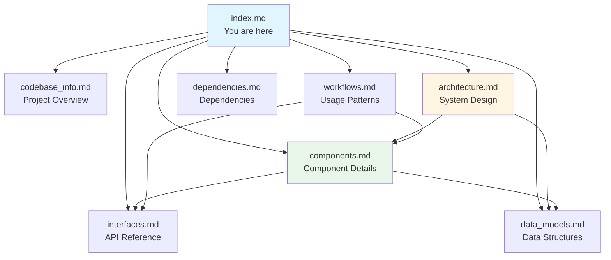

# cargo-mcp Documentation Index

## For AI Assistants

This documentation is designed to help AI assistants understand the cargo-mcp codebase and answer questions effectively. Each document focuses on a specific aspect of the system.

### How to Use This Documentation

1. **Start here** - This index provides an overview and guides you to relevant documents
2. **Consult specific documents** - Each file contains detailed information about one aspect
3. **Cross-reference** - Documents reference each other for related information
4. **Use search** - Look for keywords in document summaries below

### Quick Navigation by Question Type

| Question Type | Consult These Documents |
|--------------|------------------------|
| "How does the system work?" | architecture.md, workflows.md |
| "What components exist?" | components.md, codebase_info.md |
| "How do I call this API?" | interfaces.md |
| "What data structures are used?" | data_models.md |
| "What are the dependencies?" | dependencies.md |
| "How do I implement feature X?" | architecture.md, components.md |
| "What's the project structure?" | codebase_info.md |
| "How do errors work?" | components.md (Error Handler), data_models.md (McpError) |

---

## Document Summaries

### codebase_info.md
**Purpose**: High-level overview of the entire codebase

**Contains**:
- Project metadata (name, version, language)
- Technology stack and dependencies
- Directory structure and file organization
- Component hierarchy with Mermaid diagrams
- Code statistics and complexity scores
- Tool categories overview

**When to use**: Getting oriented with the project, understanding overall structure, finding where specific functionality lives

**Key sections**:
- Project Overview
- Technology Stack
- Codebase Structure (with diagram)
- Directory Hierarchy
- Key Components
- Architecture Patterns

---

### architecture.md
**Purpose**: System architecture and design patterns

**Contains**:
- Layered architecture diagram
- Architectural layers (Protocol, Server, Tool, Execution)
- Design patterns (Command, Builder, Error Handling, Async I/O)
- Data flow diagrams
- Request processing flow
- Error flow
- Concurrency model
- Extension points
- Performance and security considerations

**When to use**: Understanding how the system is organized, how components interact, how to extend the system, architectural decisions

**Key sections**:
- System Architecture (with diagram)
- Architectural Layers
- Design Patterns
- Data Flow (with sequence diagrams)
- Extension Points

---

### components.md
**Purpose**: Detailed documentation of each major component

**Contains**:
- Component overview diagram
- CargoMcpServer (server.rs) - 150 LOC
- Tool Executor (tools/executor.rs) - 920 LOC
- Type System (types.rs) - 211 LOC
- Error Handler (error.rs) - 44 LOC
- Tool Registry (tools/definitions.rs) - 6 LOC
- Tool Schemas (tools/workflow_tools.rs) - 200 LOC
- Component interactions and dependencies

**When to use**: Understanding what each component does, finding specific functions, understanding component responsibilities, seeing how components interact

**Key sections**:
- Component Overview (with diagram)
- Individual component documentation (purpose, responsibilities, key methods, dependencies, LOC)
- Component Interactions (with sequence diagram)
- Component Dependencies (with diagram)

---

### interfaces.md
**Purpose**: API and protocol interface documentation

**Contains**:
- MCP protocol version and transport details
- Message format (request, response, error)
- Server methods (initialize, tools/list, tools/call)
- Tool interface with common parameters
- All 20+ tool definitions organized by category
- Parameter tables for each tool
- Error codes
- Integration points

**When to use**: Making API calls, understanding protocol, finding tool parameters, implementing clients, understanding external integrations

**Key sections**:
- Protocol Interface
- Server Methods (with examples)
- Tool Interface
- Tool Categories (Build, Execution, Dependency, Project, Registry, Utility)
- Error Codes
- Integration Points

---

### data_models.md
**Purpose**: Data structures and type definitions

**Contains**:
- Protocol models (McpRequest, McpResponse, McpError)
- Tool models (Tool, CargoToolParams)
- Complete field documentation for all structures
- Data flow diagrams
- Serialization/deserialization details
- Parameter validation
- Memory layout and ownership
- Extension guidelines

**When to use**: Understanding data structures, working with types, serialization issues, adding new parameters, type definitions

**Key sections**:
- Core Data Structures (with Rust definitions)
- Protocol Models
- Tool Models
- Data Flow Diagrams
- Parameter Validation
- Serialization Format
- Extension Guidelines

---

### workflows.md
**Purpose**: Common workflows and usage patterns

**Contains**:
- Server initialization workflow
- Tool discovery workflow
- Tool execution workflow
- Development workflows (build, check, lint)
- Dependency management workflow
- Project creation workflow
- Release workflow
- CI workflow
- Error recovery workflow
- Workspace workflow
- Tool combination patterns
- Best practices

**When to use**: Understanding how to use the system, common usage patterns, workflow sequences, best practices, troubleshooting

**Key sections**:
- Primary Workflows (with sequence diagrams)
- Development Workflows (with flowcharts)
- Error Handling Workflows
- Tool Combination Patterns
- Best Practices

---

### dependencies.md
**Purpose**: Dependency documentation and management

**Contains**:
- Runtime dependencies (tokio, serde, serde_json, anyhow, clap)
- External system dependencies (cargo, rustc, clippy, rustfmt)
- Dependency graph with Mermaid diagram
- Version constraints and rationale
- Feature flags explanation
- Transitive dependencies
- Network dependencies (crates.io, git)
- Platform support
- Security considerations
- Dependency alternatives
- Performance impact

**When to use**: Understanding dependencies, troubleshooting dependency issues, updating dependencies, platform compatibility, security audits

**Key sections**:
- Runtime Dependencies (detailed for each)
- External System Dependencies
- Dependency Graph (with diagram)
- Version Constraints
- Feature Flags
- Dependency Impact (compile time, binary size, performance)

---

## Project Statistics

- **Language**: Rust (Edition 2024)
- **Total Source Files**: 9
- **Lines of Code**: 1,553
- **Functions**: 20
- **Structs/Enums**: 6
- **Largest Component**: executor.rs (920 LOC)
- **Protocol Version**: MCP 2024-11-05
- **Tool Count**: 20+

---

## Key Concepts

### MCP (Model Context Protocol)
A protocol for enabling LLMs to interact with external tools through a standardized JSON-RPC interface over stdin/stdout.

### Tool
A cargo command exposed through the MCP interface with a defined schema for parameters.

### CargoToolParams
A comprehensive parameter structure that supports all cargo command options across different tool types.

### Executor
The core component that translates MCP tool calls into cargo subprocess executions.

### Async I/O
The server uses tokio for non-blocking stdin/stdout communication, while cargo execution is synchronous.

---

## Common Tasks

### Adding a New Tool
1. Define tool schema in `workflow_tools.rs`
2. Add handler function in `executor.rs`
3. Register in `handle_tool_call()` match statement
4. Update documentation

**See**: architecture.md (Extension Points), components.md (Tool Executor)

### Understanding Error Handling
1. Review `McpError` structure in data_models.md
2. Check error constructors in components.md (Error Handler)
3. See error flow in architecture.md (Error Flow)

**See**: data_models.md (McpError), components.md (Error Handler), architecture.md (Error Flow)

### Debugging Tool Execution
1. Understand tool execution workflow in workflows.md
2. Review executor implementation in components.md
3. Check command building in architecture.md (Builder Pattern)

**See**: workflows.md (Tool Execution Workflow), components.md (Tool Executor), architecture.md (Design Patterns)

### Understanding Protocol Communication
1. Review protocol interface in interfaces.md
2. Check message formats in data_models.md
3. See communication flow in architecture.md

**See**: interfaces.md (Protocol Interface), data_models.md (Protocol Models), architecture.md (Data Flow)

---

## File Locations

### Source Code
```
src/
├── main.rs              # Entry point
├── lib.rs               # Library exports
├── server.rs            # MCP server (150 LOC)
├── types.rs             # Data structures (211 LOC)
├── error.rs             # Error handling (44 LOC)
└── tools/
    ├── mod.rs           # Module exports (6 LOC)
    ├── definitions.rs   # Tool registry (6 LOC)
    ├── workflow_tools.rs # Tool schemas (200 LOC)
    └── executor.rs      # Execution engine (920 LOC)
```

### Documentation
```
.agents/summary/
├── index.md            # This file
├── codebase_info.md    # Project overview
├── architecture.md     # System architecture
├── components.md       # Component details
├── interfaces.md       # API documentation
├── data_models.md      # Data structures
├── workflows.md        # Usage workflows
└── dependencies.md     # Dependency info
```

---

## Diagram Types Used

This documentation uses Mermaid diagrams for visual representation:

- **Graph diagrams**: System architecture, component relationships
- **Sequence diagrams**: Request/response flows, interactions
- **Flowcharts**: Workflows, decision trees
- **Class diagrams**: (Not currently used, but available for future)

All diagrams are embedded in markdown and can be rendered by Mermaid-compatible viewers.

---

## Maintenance Notes

### Last Updated
Generated from commit: `01f8748461f1b62be87ee41f81f97d69c503de88`

### Update Procedure
To update this documentation:
1. Run the codebase summary SOP with `update_mode: true`
2. Review changes in `.agents/summary/recent_changes.md`
3. Verify consolidated documentation is updated

### Known Gaps
- No test files currently present in codebase
- Limited documentation on deployment procedures
- No performance benchmarks documented

---

## Additional Resources

### External Documentation
- [MCP Protocol Specification](https://modelcontextprotocol.io/)
- [Cargo Book](https://doc.rust-lang.org/cargo/)
- [Rust Documentation](https://doc.rust-lang.org/)

### Related Files
- `README.md`: User-facing documentation
- `Cargo.toml`: Project manifest
- `mcp-config-example.json`: Example MCP client configuration

---

## Questions and Answers

### Q: How do I find where a specific cargo command is implemented?
**A**: Check components.md for the Tool Executor section, which lists all handler functions. The `handle_tool_call()` function routes to specific handlers.

### Q: What parameters does the "build" tool accept?
**A**: See interfaces.md under "Build Tools" section for complete parameter list, or data_models.md for the full `CargoToolParams` structure.

### Q: How does error handling work?
**A**: Errors flow through `anyhow::Result` internally, then convert to `McpError` for protocol responses. See architecture.md (Error Flow) and components.md (Error Handler).

### Q: Can I add custom cargo commands?
**A**: Yes, follow the extension points in architecture.md. Add tool schema, implement handler, and register in the executor.

### Q: What's the performance impact of each dependency?
**A**: See dependencies.md (Dependency Impact) for compile time, binary size, and runtime performance details.

### Q: How do I test changes?
**A**: Currently no test suite exists. Recommended approach: manual testing with MCP client or add test infrastructure (see components.md - Testing Strategy).

---

## Document Relationships



---

**For AI Assistants**: This index should be sufficient to determine which documents contain the information needed to answer most questions. Load specific documents only when detailed information is required.
