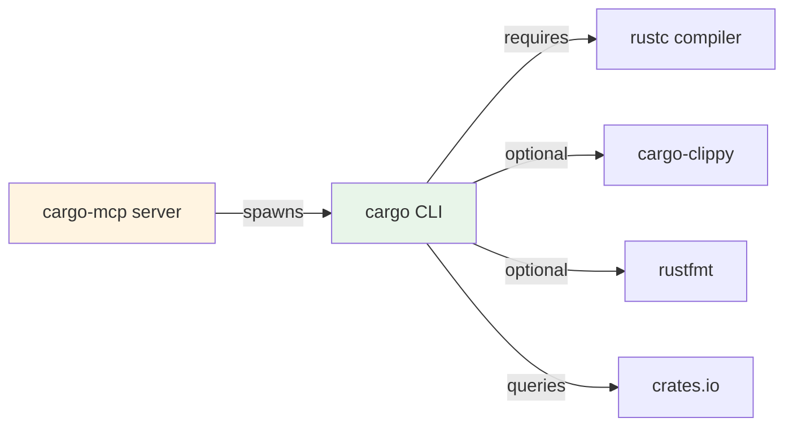

# Interfaces Documentation

## Protocol Interface

### MCP Protocol Version
**Version**: 2024-11-05

### Transport
**Method**: JSON-RPC 2.0 over stdin/stdout

### Message Format

#### Request Structure
```json
{
  "jsonrpc": "2.0",
  "id": 1,
  "method": "method_name",
  "params": {
    // method-specific parameters
  }
}
```

#### Response Structure
```json
{
  "jsonrpc": "2.0",
  "id": 1,
  "result": {
    // method-specific result
  }
}
```

#### Error Response Structure
```json
{
  "jsonrpc": "2.0",
  "id": 1,
  "error": {
    "code": -32603,
    "message": "Error description",
    "data": null
  }
}
```

---

## Server Methods

### 1. initialize

**Purpose**: Negotiate server capabilities and exchange version information

**Request**:
```json
{
  "jsonrpc": "2.0",
  "id": 1,
  "method": "initialize",
  "params": {}
}
```

**Response**:
```json
{
  "jsonrpc": "2.0",
  "id": 1,
  "result": {
    "protocolVersion": "2024-11-05",
    "capabilities": {
      "tools": {}
    },
    "serverInfo": {
      "name": "cargo-mcp",
      "version": "0.1.0"
    }
  }
}
```

---

### 2. notifications/initialized

**Purpose**: Acknowledge initialization completion

**Request**:
```json
{
  "jsonrpc": "2.0",
  "id": 2,
  "method": "notifications/initialized",
  "params": {}
}
```

**Response**:
```json
{
  "jsonrpc": "2.0",
  "id": 2,
  "result": null
}
```

---

### 3. tools/list

**Purpose**: Retrieve list of available cargo tools

**Request**:
```json
{
  "jsonrpc": "2.0",
  "id": 3,
  "method": "tools/list",
  "params": {}
}
```

**Response**:
```json
{
  "jsonrpc": "2.0",
  "id": 3,
  "result": {
    "tools": [
      {
        "name": "check",
        "description": "Analyze the current package and report errors",
        "inputSchema": {
          "type": "object",
          "properties": {
            "working_directory": {"type": "string"},
            "package": {"type": "string"},
            "release": {"type": "boolean"}
            // ... more properties
          }
        }
      }
      // ... more tools
    ]
  }
}
```

---

### 4. tools/call

**Purpose**: Execute a specific cargo tool

**Request**:
```json
{
  "jsonrpc": "2.0",
  "id": 4,
  "method": "tools/call",
  "params": {
    "name": "build",
    "arguments": {
      "working_directory": "/path/to/project",
      "release": true,
      "all_features": true
    }
  }
}
```

**Response** (Success):
```json
{
  "jsonrpc": "2.0",
  "id": 4,
  "result": {
    "content": [
      {
        "type": "text",
        "text": "Compilation successful\n\nFinished in 2.5s"
      }
    ]
  }
}
```

**Response** (Error):
```json
{
  "jsonrpc": "2.0",
  "id": 4,
  "error": {
    "code": -32603,
    "message": "Tool execution failed",
    "data": {
      "stdout": "",
      "stderr": "error: could not compile `package`"
    }
  }
}
```

---

## Tool Interface

### Common Parameters

All tools support these common parameters:

| Parameter | Type | Description |
|-----------|------|-------------|
| `working_directory` | string | Working directory for cargo command |
| `package` | string | Specific package to operate on |
| `features` | array[string] | Features to activate |
| `all_features` | boolean | Activate all available features |
| `no_default_features` | boolean | Do not activate default features |
| `release` | boolean | Use release profile |
| `target` | string | Target triple for compilation |

### Target Selection Parameters

For build, check, test, clippy:

| Parameter | Type | Description |
|-----------|------|-------------|
| `lib` | boolean | Only this package's library |
| `bin` | string | Only the specified binary |
| `bins` | boolean | All binaries |
| `example` | string | Only the specified example |
| `examples` | boolean | All examples |
| `test` | string | Only the specified test target |
| `tests` | boolean | All tests |
| `bench` | string | Only the specified bench target |
| `benches` | boolean | All benches |
| `all_targets` | boolean | All targets |

---

## Tool Categories

### Build Tools

#### check
Analyze code without producing executables.

**Parameters**: Common + Target Selection

**Example**:
```json
{
  "name": "check",
  "arguments": {
    "working_directory": "/project",
    "all_targets": true
  }
}
```

#### build
Compile the current package.

**Parameters**: Common + Target Selection + `profile`, `message_format`, `workspace`, `exclude`

#### clippy
Run Clippy lints.

**Parameters**: Common + Target Selection + `fix`, `allow_dirty`, `allow_staged`

#### fmt
Format Rust code using rustfmt.

**Parameters**: `working_directory`

---

### Execution Tools

#### run
Run a binary or example.

**Parameters**: Common + `bin`, `example`, `args`

#### test
Run unit and integration tests.

**Parameters**: Common + Target Selection + `exact`, `ignored`, `include_ignored`, `jobs`, `nocapture`, `test_threads`

#### bench
Run benchmarks.

**Parameters**: Common + Target Selection

---

### Dependency Management

#### add
Add dependencies to Cargo.toml.

**Parameters**:
- `dependency` (required)
- `dev`, `build`, `optional`
- `rename`, `path`, `git`, `branch`, `tag`, `rev`
- `features`, `default_features`
- `registry`

**Example**:
```json
{
  "name": "add",
  "arguments": {
    "working_directory": "/project",
    "dependency": "serde",
    "features": ["derive"]
  }
}
```

#### remove
Remove dependencies from Cargo.toml.

**Parameters**: `dependency` (required), `dev`, `build`

#### update
Update dependencies in lock file.

**Parameters**: `aggressive`, `dry_run`, `precise`, `workspace`

#### tree
Display dependency tree.

**Parameters**: `duplicates`, `edges`, `format`, `invert`, `no_dedupe`, `prefix`, `prune`, `depth`, `charset`

---

### Project Management

#### new
Create a new cargo package.

**Parameters**: `path` (required), `name`, `bin_template`, `lib_template`, `edition`, `registry`

#### init
Create a new cargo package in existing directory.

**Parameters**: Same as `new` but `path` is optional

#### clean
Remove build artifacts.

**Parameters**: `working_directory`

#### doc
Build documentation.

**Parameters**: Common + `open`, `no_deps`, `document_private_items`, `jobs`

---

### Registry Operations

#### search
Search packages in crates.io.

**Parameters**: `query` (required), `limit`, `registry`

**Example**:
```json
{
  "name": "search",
  "arguments": {
    "query": "tokio",
    "limit": 5
  }
}
```

#### info
Display package information.

**Parameters**: `query` (required), `registry`

#### install
Install a Rust binary.

**Parameters**: `query`, `version`, `git_url`, `branch_install`, `tag_install`, `rev_install`, `path_install`, `bin_install`, `bins_install`, `example_install`, `examples_install`, `force`, `no_track`, `locked`, `root`, `registry`, `index`, `list`

#### uninstall
Remove a Rust binary.

**Parameters**: `query` (required), `bin_install`, `root`

---

### Utility Tools

#### metadata
Output resolved dependencies in machine-readable format.

**Parameters**: `working_directory`, `no_deps`, `format_version`

#### version
Show version information.

**Parameters**: `working_directory`

---

## Error Codes

| Code | Name | Description |
|------|------|-------------|
| -32700 | Parse error | Invalid JSON received |
| -32600 | Invalid Request | JSON-RPC request is not valid |
| -32601 | Method not found | Method does not exist |
| -32602 | Invalid params | Invalid method parameters |
| -32603 | Internal error | Internal server error |

---

## Integration Points

### External Dependencies



### File System Interactions

- **Read**: Cargo.toml, Cargo.lock, source files
- **Write**: Cargo.toml (add/remove), target/ directory (build artifacts)
- **Execute**: cargo binary and related tools

### Network Interactions

- **crates.io**: Package search, info, install operations
- **Git repositories**: Dependency installation from git sources
