# Workflows Documentation

## Primary Workflows

### 1. Server Initialization Workflow

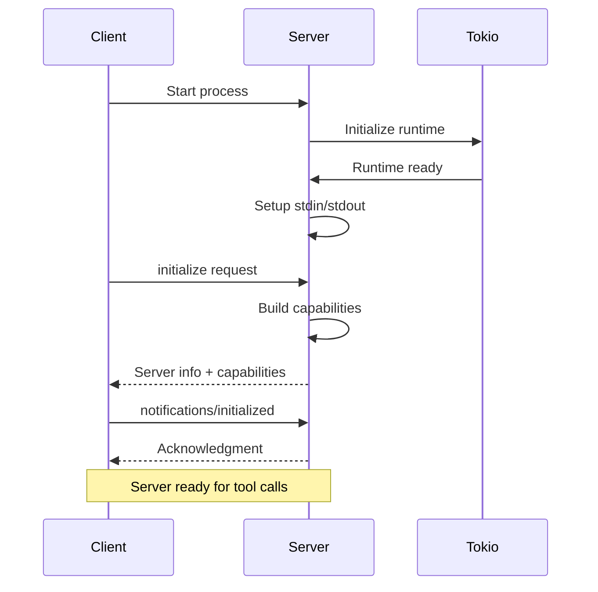

**Steps**:
1. Client spawns cargo-mcp process
2. Server initializes tokio async runtime
3. Server sets up stdin/stdout readers/writers
4. Client sends `initialize` request
5. Server responds with protocol version and capabilities
6. Client sends `notifications/initialized`
7. Server is ready to handle tool calls

---

### 2. Tool Discovery Workflow

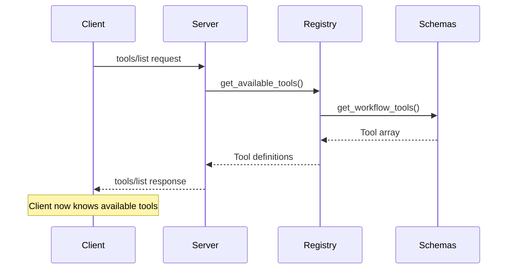

**Steps**:
1. Client requests tool list
2. Server calls tool registry
3. Registry retrieves tool schemas
4. Server returns array of tool definitions with schemas
5. Client caches tool information

---

### 3. Tool Execution Workflow

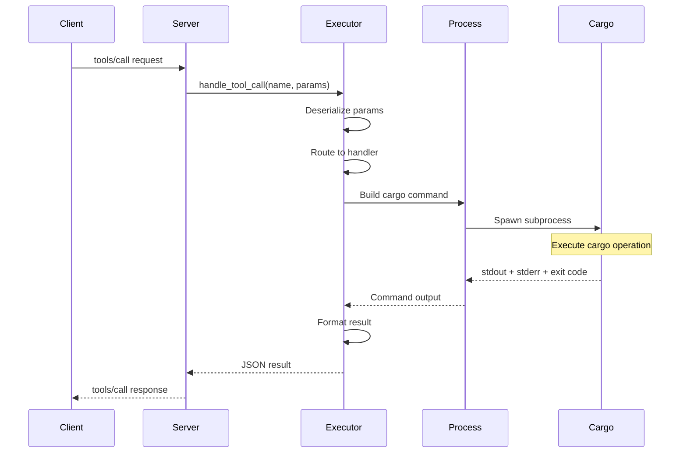

**Steps**:
1. Client sends tool call with name and arguments
2. Server routes to executor
3. Executor deserializes parameters to `CargoToolParams`
4. Executor selects appropriate handler based on tool name
5. Handler builds cargo command with flags
6. Process spawns cargo subprocess
7. Cargo executes and returns output
8. Executor formats output as MCP response
9. Server sends response to client

---

## Development Workflows

### 4. Build and Check Workflow

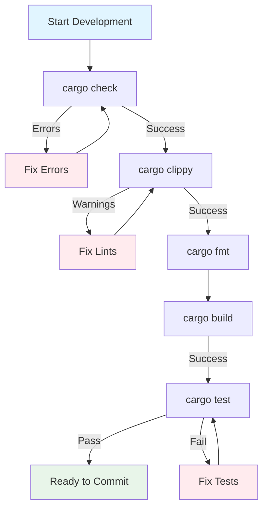

**MCP Tool Sequence**:
1. `check` - Fast compilation check
2. `clippy` - Lint analysis
3. `build` - Full compilation
4. `test` - Run test suite
5. `fmt` - Code formatting (run separately as needed)

---

### 5. Dependency Management Workflow

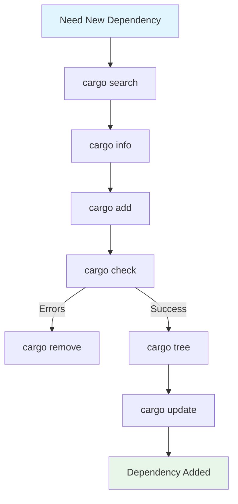

**MCP Tool Sequence**:
1. `search` - Find packages on crates.io
2. `info` - Get package details
3. `add` - Add dependency to Cargo.toml
4. `check` - Verify compilation
5. `tree` - Visualize dependency graph
6. `update` - Update lock file

---

### 6. Project Creation Workflow

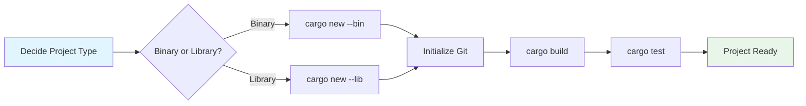

**MCP Tool Sequence**:
1. `new` - Create new project with template
2. `build` - Initial compilation
3. `test` - Verify default tests pass

---

### 7. Release Workflow

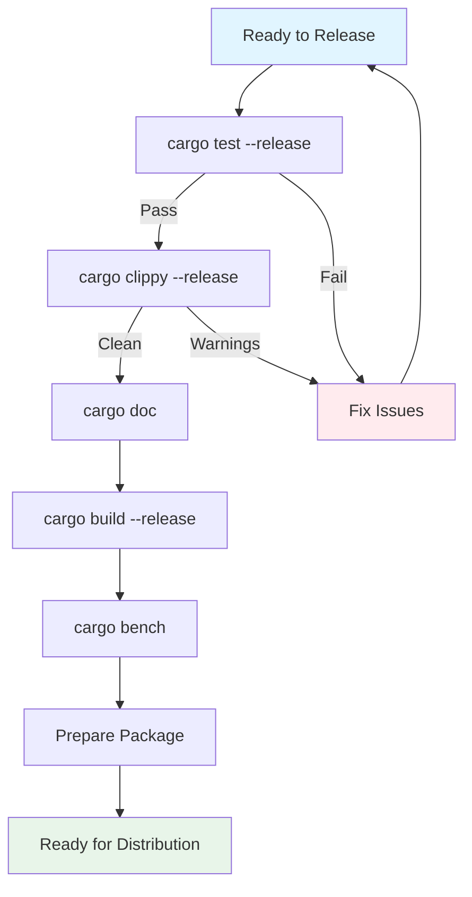

**MCP Tool Sequence**:
1. `test` with `release: true` - Test optimized build
2. `clippy` with `release: true` - Lint release build
3. `doc` - Generate documentation
4. `build` with `release: true` - Create release binary
5. `bench` - Run benchmarks

---

### 8. Continuous Integration Workflow

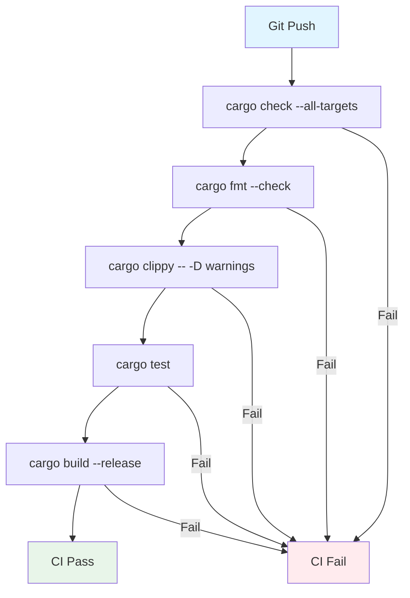

**MCP Tool Sequence**:
1. `check` with `all_targets: true` - Check all code
2. `fmt` - Verify formatting
3. `clippy` - Enforce lint rules
4. `test` - Run full test suite
5. `build` with `release: true` - Verify release build

---

## Error Handling Workflows

### 9. Error Recovery Workflow

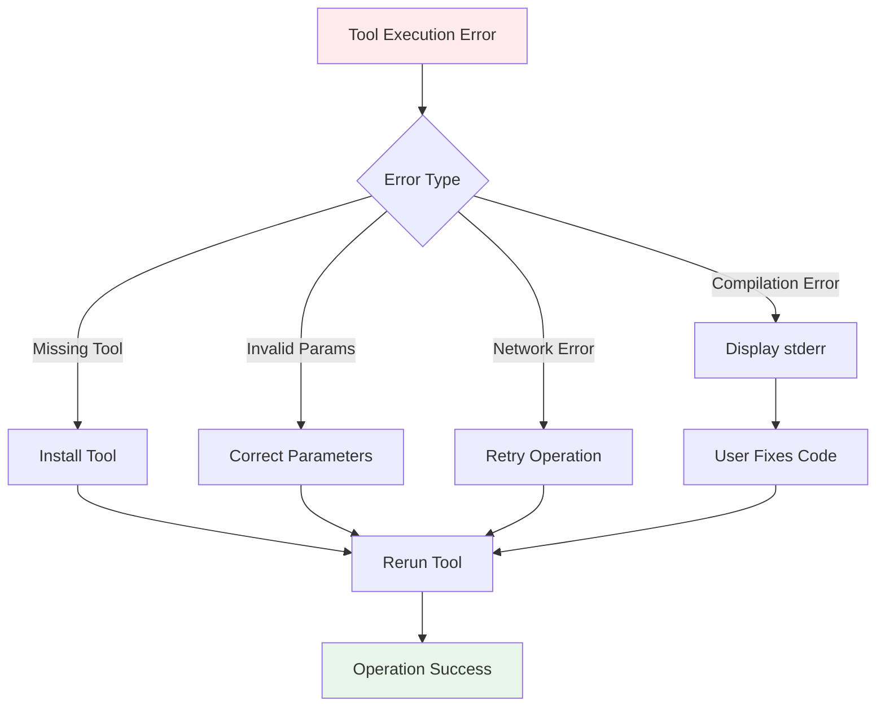

**Error Handling**:
1. Executor catches cargo errors
2. Formats error with stdout/stderr
3. Returns as `internal_error` with details
4. Client displays error to user
5. User corrects issue and retries

---

### 10. Workspace Workflow

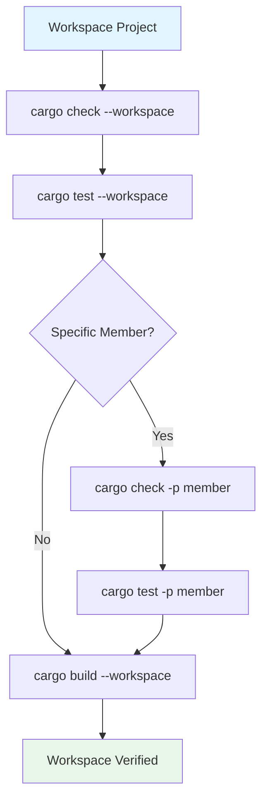

**MCP Tool Sequence**:
1. `check` with `workspace: true` - Check all packages
2. `test` with `workspace: true` - Test all packages
3. `check` with `package: "member"` - Check specific package
4. `build` with `workspace: true` - Build all packages

---

## Tool Combination Patterns

### Quick Validation
```
check → clippy
```

### Full Build Cycle
```
check → build → test → doc
```

### With Formatting
```
fmt → check → build → test
```

### Dependency Update
```
update → tree → check → test
```

### New Feature Development
```
add → check → test → clippy
```

### Code Formatting
```
fmt (run separately as needed)
```

### Release Preparation
```
test --release → clippy --release → doc → build --release → bench
```

---

## Async Operation Flow

### Request Processing Loop

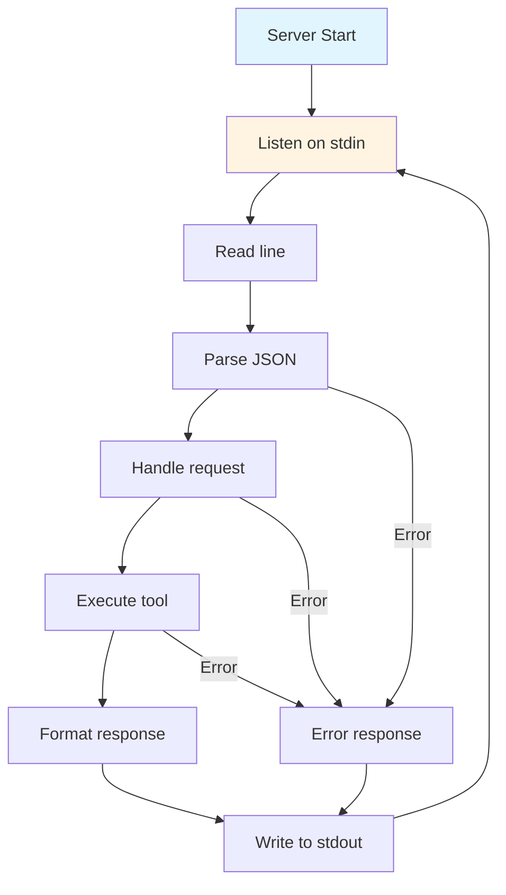

**Async Characteristics**:
- Non-blocking stdin/stdout
- Synchronous cargo execution (blocking)
- Sequential request processing
- No concurrent tool execution

---

## Best Practices

### Efficient Tool Usage
1. Use `check` before `build` for faster feedback
2. Run `clippy` with `--fix` to auto-correct issues
3. Use `tree` to understand dependency conflicts
4. Run `test` with specific filters for faster iteration

### Error Prevention
1. Always specify `working_directory` for clarity
2. Use `dry_run` for destructive operations
3. Check `metadata` before complex operations
4. Validate with `check` before `build`

### Performance Optimization
1. Use `release: false` during development
2. Limit `all_targets` to specific targets when possible
3. Use `jobs` parameter to control parallelism
4. Cache dependencies with `update` sparingly
